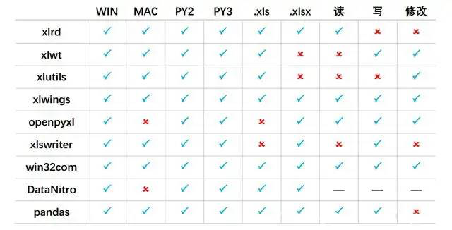
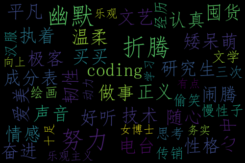
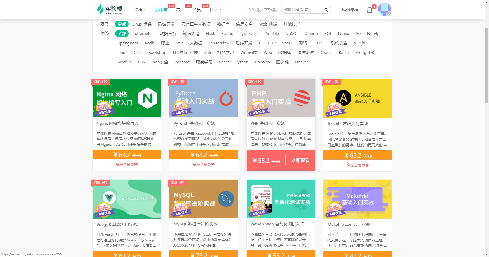

# Python自动化办公课程大纲

## 实验1 Python自动化办公介绍和环境的安装
### 一、实验介绍
- 1.1 知识点
    - 为什么需要Python自动化办公？
    - Python操作Excel、Word、PDF分别用到哪些第三方库
    - 为什么选择这些第三方库？第三方库的安装和验证
    - 自动化办公的演示，并提供代码进行预习。
- 1.2 实验环境
- 课程使用的实验环境为 WebIDE 容器 1G版本。实验中会用到程序：Python
### 二、实验内容
- 2.1 Python自动化办公介绍
    - 为什么需要Python自动化办公？
    - Python操作Excel、Word、PPT、PDF分别用到哪些第三方库
- 2.2 第三方库的安装和验证
    - Excel：xlwings
    - Word：python-docx
    - PDF：PyPDF2和pdfplumber
    - 验证安装成功
    	- pip show XX库
- 2.3 自动化办公的演示
    - Excel自动化办公演示
    - Word自动化办公演示
    - PDF自动化办公演示
    - 爬虫演示

---
## 实验2 Python读写任意Excel中内容
### 一、实验介绍
- 1.1 知识点
    - Python读取Excel为什么选择xlwings？
    - 读取指定Excel的指定内容
- 1.2 实验环境
    - 课程使用的实验环境为 WebIDE 容器 1G版本。实验中会用到程序：Python IDE
### 二、实验内容
- 2.1 xlwings的优势和安装
    - xlwings基础api的介绍
    - 
- 2.2 读取单个文件
    - 需要使用 glob 库
- 2.3 读取指定sheet
- 2.4 读取指定单元格
- 2.5 批量读取单元格内容

---
## 实验3 Python写入Excel内容
### 一、实验介绍
- 1.1 知识点
    - 写入指定Excel指定内容
- 1.2 实验环境
    - 课程使用的实验环境为 WebIDE 容器 1G版本。实验中会用到程序：Python IDE
### 二、实验内容
- 2.1 指定单元格赋值并保存
- 2.2 使用excel公式
- 2.3 增加指定sheet
- 2.4 创建新的Excel文件
- 2.5 合并多个Excel到一个Excel

---
## 实验4 Python设置Excel样式
### 一、实验介绍
- 1.1 知识点
    - 设置Excel的字体和样式
- 1.2 实验环境
    - 课程使用的实验环境为 WebIDE 容器 1G版本。实验中会用到程序：Python IDE
### 二、实验内容
- 2.1 获取Excel中已有的字体和样式
- 2.2 修改字体和样式
- 2.3 设置填充样式
- 2.4 合并单元格
---
## 实验5 Python处理Excel案例实操：秘书阿峰统计公司员工的年出勤率（一）
### 一、实验介绍
- 1.1 知识点
    - 案例介绍
    - 读取所有Excel的所有数据
    - 对数据进行判断和计算
- 1.2 实验环境
    - 课程使用的实验环境为 WebIDE 容器 1G版本。实验中会用到程序：Python IDE
### 二、实验内容
- 2.1 读取所有Excel中的数据
- 2.2 如何判断单个表格读取结束？
- 2.3 读出来的数据放在哪里？
- 2.4 对数据进行判断和计算，并输出到控制台
---
## 实验6 Python处理Excel案例实操：秘书阿峰统计公司员工的年出勤率（二）
### 一、实验介绍
- 1.1 知识点
    - 输出结果到Excel中
    - 对输出的结果进行样式的设置
- 1.2 实验环境
    - 课程使用的实验环境为 WebIDE 容器 1G版本。实验中会用到程序：Python IDE
### 二、实验内容
- 2.1 使用pandas输出结果
- 2.2 设置需要的样式

---
## 实验7 Python处理Word案例实操：读取word中的内容，并制作可视化词云
### 一、实验介绍
- 1.1 知识点
    - python-docx介绍，基础api介绍
    - 词云介绍和制作
- 1.2 实验环境
    - 课程使用的实验环境为 WebIDE 容器 1G版本。实验中会用到程序：Python IDE
### 二、实验内容
- 2.1 使用python-docx读取Word内容
- 2.2 利用读取的内容制作词云
    - 
---
## 实验8 Python处理PDF介绍
### 一、实验介绍
- 1.1 知识点
    - PyPDF2 和 pdfplumber 介绍，基础api应用
- 1.2 实验环境
    - 课程使用的实验环境为 WebIDE 容器 1G版本。实验中会用到程序：Python IDE
### 二、实验内容
- 2.1 提取pdf中的文字
- 2.2 合并拆分PDF
- 2.3 添加水印，加密解密
---
## 实验9 简单爬虫的实现：批量下载155张网页图片
### 一、实验介绍
- 1.1 知识点
    - 爬虫简单介绍
- 将爬虫数据保存进入Excel中
- 1.2 实验环境
    - 课程使用的实验环境为 WebIDE 容器 1G版本。实验中会用到程序：Python IDE
### 二、实验内容
- 2.1 爬虫是什么？爬虫涉及哪些知识点？
- 2.2 爬虫怎么写？怎么运行？
- 2.3 爬取的数据保存进入Excel中。
- 2.4 代码逻辑和演示
    - 目标网站：https://www.shiyanlou.com/bootcamp/
    - 
    - 爬取课程信心，保存在一个Excel中。
